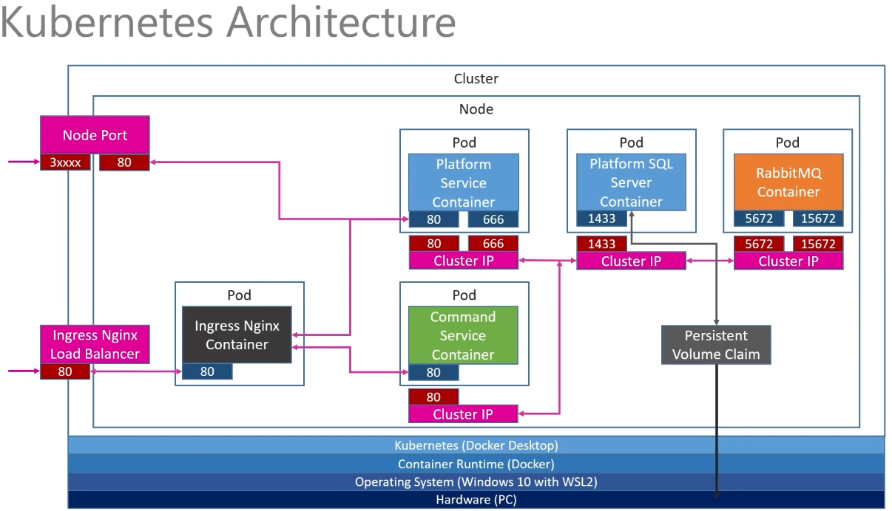

# A example implementation of Microservices using .NET and Kubernetes

This repository contains code demonstrated in the [YouTube](https://www.youtube.com/watch?v=DgVjEo3OGBI) course on Microservices using .NET by Les Jackson.

## Kubernetes Architecture

## Commands

### .NET CLI

`dotnet ef` is no longer part of .NET CLI tool, it has to be installed either globally or locally.
`dotnet tool install --global dotnet-ef`, and ensure `PATH` includes `$HOME/.dotnet/tools` if installed globally.

### Docker
- `docker build -t elithrade/platformservice .` will build the local docker image using `latest` tag.
- `docker push elithrade/platformservice` will push the image to Docker Hub.

### Kubernetes
- `kubectl get deployments` will get the current deployments.
- `kubectl get pods` will get the current pods.
- `kubectl get services` will get the current services.
- `kubectl apply -f ./k8s/{.yml}` will apply settings in `.yml` file and create resources accordingly.
- `kubectl rollout restart deployment platforms-depl` will refetch the latest image in Docker Hub and restart the service.
- `kubectl get pvc` will get the persistence volume claims.
- `kubectl create secret generic mssql --from-literal=SA_PASSWORD="{SECRET}"` will create a database `sa` password with name `mssql` and key `SA_PASSWORD`. [platforms-mssql-depl.yml](./k8s/platforms-mssql-depl.yml) will use the secret `mssql` when creating the database.

## Install `ingress-nginx`
See link https://kubernetes.github.io/ingress-nginx/deploy/#quick-start for installation on different operating system. After installation remember to update `hosts` file by adding an entry that maps `127.0.0.1` to the `host` defined [ingress-service.yml](./k8s/ingress-service.yml).

## Notes

### Environments
Environments are configured in `appsettings|{.Env}.json` file. For more details refer to https://docs.microsoft.com/en-us/aspnet/core/fundamentals/environments?view=aspnetcore-6.0 for more details.

### What's the difference between `ClusterIP`, `NodePort` and `LoadBalancer` service types in Kubernetes?
- `ClusterIP`: Expose service through k8s cluster with `ip/name:port`.
- `NodePort`: Expose service through internal network also to k8s `ip/name:port`.
- `LoadBalancer`: Expose service through external world or whatever you defined in your load balancer.